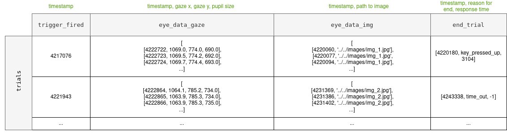

# Gaze contingency

## About
This project aims to develop a framework for assessing Simulated Prosthetic Vision (SPV) experiments on gaze contingency. This script is written in Python 3.10 and works with the EyeLink1000 provided by [SR Research](https://www.sr-research.com/).

This script has been adapted from the example script provided by SR Research in `C:\Program Files (x86)\SR Research\EyeLink\SampleExperiments\Python\examples\Pygame_examples\fixationWindow_fastSamples.py`. For more information, visit [SR Research SUPPORT](https://www.sr-research.com/support/thread-7525.html).

### Demo

Tracking the position of the eye:

Rendering parts of the image based on the current eye position:

Rendering a gaze-contingent edge-detected version of the image:

## Visual representation methods
In regard to visual representation, the methods available are:
* **Edge detectors**: canny, sobel 
* **Deep learning models**: the models from Jaap and Ashkan.

The edge detection model logic is contained in `edgeDetection.py`.

The deep learning (DL) models come from the [spv-Player](https://github.com/arnejad/spv-Player) repo and the relevant logic is copied into this repo in the `spvPlayer/` directory.

## How to start

Make a new venv and install the following packages:

    pip install opencv-python
    pip install pygame
    pip install PIL
    pip install --index-url=https://pypi.sr-support.com sr-research-pylink

- [ ] _Update the above with a pip requirements file_.

Set the parameters to chosen values inside `parameters.py`. If you want to use a DL method for visual representation, ensure:
* the parameters in `spvPlayer/config.py` are also set to chosen values
* the models from the original [spv-Player](https://github.com/arnejad/spv-Player) repo are copied into the `spvPlayer/models` directory. See the `README.me` in the original [spv-Player](https://github.com/arnejad/spv-Player) repo for the download link.

Copy in any images you want to use inside the `\images` directory.

Start the script `main.py` with your workstation connected to the host PC with EyeLink configured.

### Output of the script
The results will be created inside the `results\{result_fn}_{dt}\` directory where `{result_fn}` is a command-line input given by the experimenter (name of the run) and `{dt}` is the current datetime. Inside this directory, the following files will be populated:
* `{result_fn}_{dt}.EDF` file: this is the output from EyeLink
* `{result_fn}_{dt}.asc` file: this is the .EDF file converted into ASCII
* `{result_fn}_{dt}` file: this is the pickled Pandas dataframe containing the useful results for further analysis. See _Resulting Dataframe_ for further explanation.
* `{result_fn}_{dt}.txt` file: this file contains the parameter values chosen for this run, as retrieved from the `parameters.py` file 

Additionally, the following folder will be generated:
* `rendered_experiment/`: this folder will contain a subdirectory for each of the number of input images you have provided. E.g. with the 2 example images, the subdirectories created are `stimulus_1/` and  `stimulus_2/`. Each of these subdirectories contains images of each of the screens the participant sees in the experiment. You can use the `make_gif.py` script to create a gif out of these images to display the experiment how the participant has experienced it.

#### Resulting Dataframe
The important events from the EDF file are captured and stored in a Pandas dataframe. This is to enable ease of further analysis. The structure of the resulting dataframe is as follows:
* Each row is a new trial (i.e. presentation of a new stimulus).
* The columns are, respectively:
  * `trigger_fired`: A timestamp (int) of when the participant fixated successfully on the trigger, and thus launched the start of the stimuli presentation for this trial. 
  * `eye_data_gaze`: This is a list of list where each nested list is either:
    * A timestamp (int) of when a blink event occured.
    * A timestamp (int) with corresponding eye gaze coordinates x and y (floats) and the pupil size (float).
  * `eye_data_img`: This is a list of lists where each nested list is a timestamp (int), the name of the image displayed at this time complete with path (string), and 2 sets of x, y coordinates (tuples) demonstrating the start and end positions of the gaze-contingent window.
  * `end_trial`: This is a list containing a timestamp (int) of when the trial ended, the event that caused it to end (string), and the response time (int).

To perform further analyis on the dataframe, simply read in the pickled dataframe: `df = pd.read_pickle(path_to_pickled_df)`.